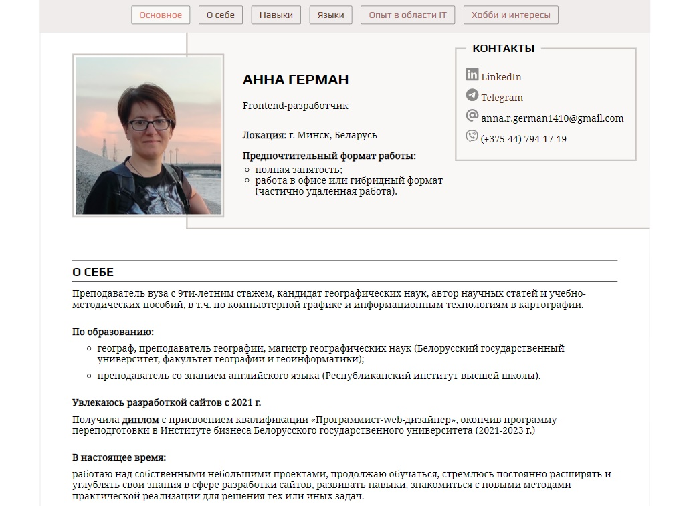
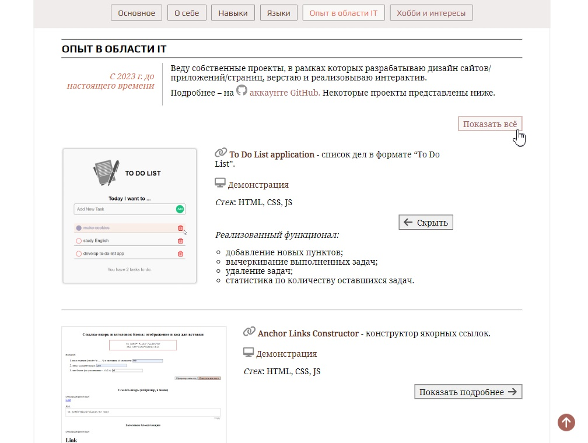

# Герман Анна - CV (HTML | CSS | JS)

## О проекте
Мой персональный CV, включающий основные классические разделы: основная информация (имя, должность, локация, контакты), "О себе", "Навыки", "Языки", "Опыт в области IT", "Хобби и интересы".

**Инструменты:** 

**Языки:** 
 
 
 

**Демо:** [Перейти на сайт](https://the-all-spark.github.io/GermanA_CV/)  

## Реализованный функционал:
1. верстка с использованием grid, flex, якорных ссылок в закрепленной навигационной панели, плавной прокрутки и др.;
2. при клике на пункт меню страница плавно прокручивается до соответствующего блока;
3. при прокручивании страницы выделяется ссылка в меню, соответствующая текущему (отображенному в окне браузера) блоку;
4. __блок "Опыт в области IT"__:
   - при клике на кнопку "Показать подробнее" открывается информация о проекте ("Реализованный потенциал"); кнопка меняется на "Скрыть";
   - при клике на отобразившуюся кнопку "Скрыть" дополнительная информация "сворачивается";
   - при клике на кнопку "Показать всё" отображается информация обо всех проектах ("Реализованный потенциал"); сама кнопка меняется на "Скрыть всё";
5. При прокручивании вниз страницы отображается иконка "Вверх" (стрелка), при клике на которую страница прокручивается к верхнему блоку.
6. Добавлена адаптивная верстка для ширины экрана от 1500 до 320 px.

